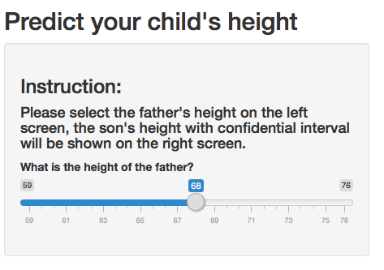
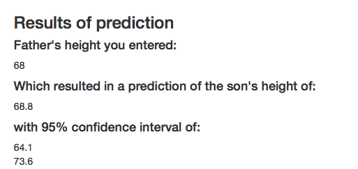

Shiny App to Predict Child's height 
========================================================
author: Xinzhu
date: Aug 2, 2017
width: 1920
height: 1080

What this app does?
========================================================

- This app predict son's height based on father's height.
- It gives a confidential interval of the son's height. 
- It shows where the predicted height lays in the total samples.

Here is where you input father's height:
========================================================

The app will calculate son's height
========================================================
e.g. Let's say that father's height is **68**:

The app will give a prediction of son's height of **68.8**, with confidential interval of **64.1** and **73.6**.

The format of output is shown below:  

The app also shows where the input and output lay in the total samples:
========================================================

